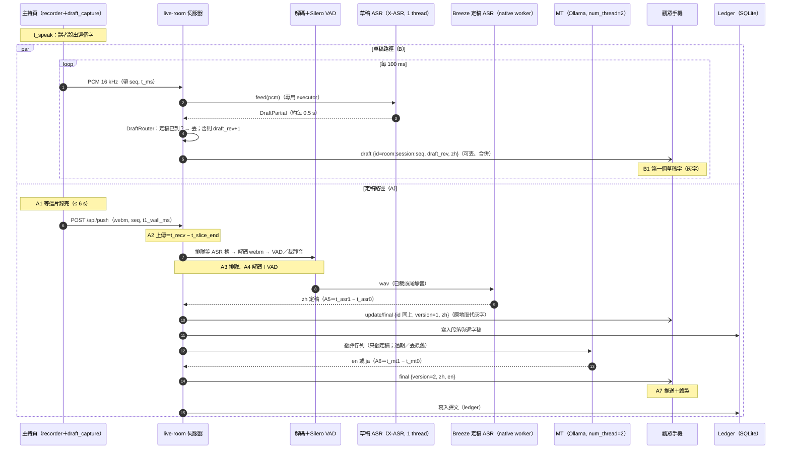

# zen-bridge 桌面即時翻譯架構（兩段式 ASR＋本機 MT＋示意圖＋metrics）

- 作者：arch（架構師代理），2026-10-10 23:xx（台北）。基準 commit：`6ec5012`（PR #8 head，`feat/local-translation-backend`）。
- 範圍：**只做筆電桌面版**（DESKTOP-P8RGA3A，Ryzen 5 5600H 6C/12T、15.4 GB RAM、Radeon 內顯、無 NVIDIA）。每場只選一種目標語（en **或** ja）。
- 這份是設計文件，**沒有改任何程式**。程式行號都對照 `6ec5012`。
- 數字規則：每個數字都附來源（檔案／章節），或標「box 量測（Xeon，非 5600H）」或「推估」。研究檔路徑簡寫：`R3`＝`zen-research/round3.md`、`R4`＝`round4.md`、`OPT2`＝`optimization-round2.md`、`HW`＝`hardware.md`、`DEF`＝`zen-sandbox/out/grok-local-v2/DEFECTS.md`。
- 本文 box 量測：arch 在 23:2x 用執行手的 `XAsrDraft`（`wt-r4` commit `5caf498`）載入真的 X-ASR 模型跑 `test_wavs/0–3.wav`（共 28.7 s，R3 §3.3 同一批音檔）。

---

## 0. 三個最重要的決定（先讀這節）

| # | 決定 | 理由（來源） |
|---|---|---|
| **K1** | **草稿不進現有的版本與儲存管線。** 草稿用獨立事件型別 `draft`，沿用同一個段落 id `room:session:seq`，但帶 `draft_rev`、**不帶也不改 `version`**；不經 `Dispatch.publish()`、不配 cursor、不進 history／ledger／TM／匯出。只要該 id 出現過 `version ≥ 1` 的事件，草稿一律丟棄（伺服器和觀眾端各擋一次）。 | `Dispatch.publish()` 會把缺 `version` 補成 1（`app/dispatch.py:90`）並以 `version <= best` 去重（`:97`），還會配 cursor 存 history（`:100`）。草稿若走這條路，會吃掉定稿的版本號或被重播。現有的單調版本契約（`pipeline.py:1320,1336,1341` 的 `version+1`、`_version_floor` `:221`）完全不用改。 |
| **K2** | **草稿和示意圖都是「可丟」的低優先流量，不能用現有 `ListenerSlot.offer()` 送。** 現有 `offer()` 佇列滿時會把整條觀眾連線關掉（`dispatch.py:384-393`，`alive=False`）。草稿每約 0.5 s 一筆（box 量測），示意圖可能很大；要另做「滿了就丟、同 id 只留最新」的送法，示意圖走**獨立頻道**。 | 字幕（final/update）不能因為草稿或示意圖塞車而斷線。 |
| **K3** | **CPU 預算以「重執行緒 ≤ 6 顆實體核」為硬上限：Breeze 4＋MT 2；草稿 X-ASR 固定 1 執行緒**（量起來平均不到 0.1 顆核）。Breeze 子程序由我們自己啟動，所以可以設 affinity／優先權／關 EcoQoS；Ollama runner 不行，只能用 `num_thread` 限制。 | HW §4.1「同時跑時兩者加起來不要超過 6 個重執行緒」；R4 D1：X-ASR int8 `threads≥2` 在 box 上輸出不穩定，`threads=1` 30/30 一致；R4 §2.1：`threads=2` 實際會吃 3–4 顆核；HW §5.2 末段：zen-bridge 不能設 Ollama runner 的 priority／affinity。 |

---

## 1. 兩段式 ASR

### 1.1 元件與資料流

| 路徑 | 輸入 | 元件 | 輸出 | 寫 ledger／TM | 翻譯 |
|---|---|---|---|---|---|
| **(B) 草稿** | 主持頁 16 kHz mono PCM，100 ms 一包（R4 §3.1 流程圖 B；前端新檔 `draft_capture.js` 由執行手第 2 批做，見 `GROK_ROUND4_LANES.md`） | `app/draft_asr.py` `XAsrDraft`（sherpa-onnx X-ASR 480 ms streaming transducer，int8，`num_threads=1`）＋ OpenCC `s2twp` | `draft` 事件（灰字） | **否** | 預設否（§2.3） |
| **(A) 定稿** | 主持頁 MediaRecorder 每 6 s 一片（`static/host.html:519` `periodMs: 6000`）→ `/api/push` | 解碼 → Silero VAD（`app/vad.py`）→ Breeze-ASR-25（`native_asr.py`／`native_worker.py`，whisper.cpp） | `update`／`final` 事件（現有格式，`pipeline.py:94-117`） | 是（現況） | 是 |

- X-ASR 選擇和參數：R3 C4、R4 §2.3（預設 480 ms int8、`num_threads=1`；5600H 若不穩定改 fp32）。
- 草稿模型數字（box 量測（Xeon，非 5600H），本文）：int8 `threads=1` RTF 0.086、程序 RSS 峰值 273 MB；fp32 `threads=1` RTF 0.206、RSS 峰值 711 MB。R4 §2.1 的數字（RTF 0.087、第一個草稿字中位數 1.2–2.1 s）是同一台 box。
- 草稿 partial 間隔：box 量測（Xeon，非 5600H）每約 500 ms 一筆（0.wav 的 `t_ms` 8800→9300→9800），對應 480 ms chunk。

### 1.2 id 與版本對應（核心契約）

現有契約（不改）：
- 段落 id＝`f"{room_id}:{session_id}:{seq}"`（`pipeline.py:90-92`），`seq` 是主持頁錄音片序號。
- `version` 從 1 起，每次重辨識／修正／翻譯完成就 `+1`（`pipeline.py:1320,1336,1341,1823,1936`），重啟後用 `_version_floor` 保證不倒退（`:221`、`:2179-2186`）；`_seen_versions` 防重送（`:970-975`）；`Dispatch.publish()` 丟掉 `version <= best`（`dispatch.py:97`）。

草稿如何掛上去：

| 欄位 | 草稿事件 `draft` | 定稿事件 `update`／`final` |
|---|---|---|
| `type` | `"draft"`（新增型別） | 現有 |
| `id` | **同一個** `room:session:seq`。`seq`＝這包 PCM 擷取時主持頁「目前那一片」的序號（`draft_capture.js` 在每包帶上 `seq` 和 `t_ms`） | 現有 |
| `version` | **不帶**（觀眾端視為 0） | ≥ 1（現有） |
| `draft_rev` | 同一 id 內單調遞增的整數（伺服器 `DraftRouter` 配發） | 不帶 |
| `zh` | 草稿全文（s2twp 後，去掉開頭標點，見 §6.2 R-3） | 現有 |
| `sealed` | `true`＝X-ASR 判定這句結束（endpoint） | — |
| `t0_ms`／`t1_ms` | 這段草稿涵蓋的音訊時間（主持頁時鐘） | 現有 |

規則（伺服器 `DraftRouter`，新增提議模組 `app/draft_router.py`，由整合者掛到 `server.py`）：
1. **定稿優先**：發草稿前查 `pipeline.get(room, session, seq)`（`pipeline.py:236`）；只要該段已存在且 `status` 不是 `queued`（亦即已有 Breeze 結果或已失敗／刪除），草稿**丟掉**。觀眾端再擋一次：記住每個 id 看過的最大 `version`，`≥ 1` 之後收到的 `draft` 一律忽略（事件可能在不同佇列裡交錯）。
2. **跨片切割（前綴凍結）**：X-ASR 是按「句」出結果，不按 6 s 片。當 PCM 的 `seq` 從 N 變 N+1、而這句還沒 endpoint 時，把目前文字凍結成 seq N 的最後一筆草稿（`sealed=true`），之後 seq N+1 的草稿只送「去掉凍結前綴後的部分」。若新 partial 不再以凍結前綴開頭（模型改字），seq N+1 送全文並帶 `overlap=true`，觀眾端照樣顯示（短暫重複，等定稿取代）〔設計取捨〕。
3. **草稿永遠不改寫定稿、也不產生 `version`**；Breeze 的結果照現況以 `version=1` 進來，觀眾端看到 `version ≥ 1` 就**原地取代**同 id 的灰字（R4 §7 第 5 項「定稿同 `seq` 原地取代」）。
4. **暫停／刪除／清空**：`pause_room`（`pipeline.py:767`）時 `DraftRouter.reset(room)`、清掉輸入佇列、不再發草稿；恢復後「擷取時間 < 恢復＋1 s」的草稿也丟（和定稿同規則，`pipeline.py:834` `_pause_blocks`）。`brace_delete`／`delete_segment`／`clear` 時，該 id 的草稿狀態丟掉，觀眾端收到 `caption_deleted` 時一併清除灰字。
5. **只在手機模式顯示**：`project`（投影）模式不顯示草稿（R3 §1.2「投影只顯示定稿」、§1.4 驗收）。
6. **不寫任何持久層**：草稿不進 ledger、TM、glossary、匯出、replay history（`draft_asr.py` 原設計，R3 §3.4）。觀眾斷線重連只拿到定稿。

### 1.3 草稿執行模型（取消、逾時、資源）

| 項目 | 設計 | 控制 |
|---|---|---|
| 執行緒 | 每個「正在直播的房間」一個 `XAsrDraft`，放在**專用的單執行緒 executor**（不能在 event loop 上跑 `feed()`，它是同步 CPU 工作）。桌面版同時只會有 1 個直播房間〔推估，桌面情境〕；`max_rooms` 預設 8（`settings.py:79`），所以要設上限 | `BREEZE_DRAFT_MAX_ROOMS`（**新增提議**，預設 1） |
| 輸入佇列 | 有界，預設 20 包＝2 s 音訊〔推估〕。滿了：丟最舊的包並 `reset()` 串流（草稿可丟，不能越積越晚） | `BREEZE_DRAFT_QUEUE`（**新增提議**） |
| 發送頻率 | 同 id 只送文字有變的 partial，且每房每秒最多 2 筆（對應 box 量測的 ~0.5 s 間隔） | `BREEZE_DRAFT_MAX_HZ`（**新增提議**，預設 2） |
| 落後偵測 | 草稿處理時間落後音訊 > 3 s〔推估〕→ 視為過載，觸發 §5 降級（關草稿 ASR） | 同 §5 |
| 取消 | 停止／暫停／關房：清佇列、`reset()`、丟掉 executor 中還沒送出的結果（用 room generation 比對，同 `pipeline._stale()` 的作法 `pipeline.py:540`） | — |
| 逾時 | `feed()` 是有界的 CPU 工作（每包 100 ms 音訊），不設網路逾時；單包處理 > 1 s〔推估〕記一次 `draft_slow`，連 3 次觸發降級 | — |
| 資源 | `reset()` 只換 stream；關房要釋放 recognizer（`XAsrDraft` 目前沒有 `close()`，見 §8 審查 R-5） | — |
| 失敗 | 模型或套件缺少 → `NullDraft`（現況 fail-soft），但**要在 `/api/setup` 和 log 顯示原因** | 見 §8 審查 R-4 |

---

## 2. 翻譯（MT）

### 2.1 引擎與每場一種語言

| 項目 | 設計 | 來源／現有設定 |
|---|---|---|
| 引擎 | 本機 Ollama（原生 `/api/chat`，才能帶 `num_thread`／`num_ctx`） | `translate_config.py:137-148`（port 11434 自動走 ollama 協定）；HW §2.4 第 10 點（`/v1` 不吃 options） |
| 模型 | 現有預設 `qwen3:4b`（`translate_config.py:24`，`start_backend.ps1:18`）。Hy-MT2-1.8B 走 `mt_backend.py` 的 llama-server 路徑（預設關，`BREEZE_MT_BACKEND=hymt`） | Hy-MT2 Q4_K_M box 量測（Xeon，非 5600H）zh→en p50 0.93 s、zh→ja 1.31 s（R4 §2.4）；ja 建議 Q8_0（R4 D3） |
| 目標語 | 每個 (room, session) 只有一種：`en` 或 `ja`；中途切換從**下一段**生效 | `mt_backend.py` `SessionTargets.switch()`（`last_seq+1`）；`BREEZE_DEFAULT_TGT_LANG` |
| 只翻定稿 | 只有 Breeze 定稿（`zh_ready`）進翻譯佇列（現況） | `pipeline.py:921,1740` |
| 思考模式 | qwen3 一律關 thinking（`/no_think`＋`think:false`） | `translate_config.py:112-116` |

### 2.2 佇列、過期與丟棄政策（沿用現況，補兩點）

| 規則 | 現況（不改） | 來源 |
|---|---|---|
| 佇列長度 | 4 | `settings.py:106` `BREEZE_TRANSLATE_QUEUE` |
| 滿了 | **丟最舊的等待句**，標 `skipped_backlog`，中文保留 | `pipeline.py:1750-1777` `_offer_translation` |
| 過期 | 等待 > 8 s 且後面有更新的句子 → `skip`（或 `merge` 併入下一句） | `runtime_tuning.py` `BREEZE_TRANSLATE_STALE_S=8`、`BREEZE_TRANSLATE_STALE_POLICY=skip`；`pipeline.py:1978-1986` |
| 太晚回來 | 從入列到回來 > `BREEZE_TRANSLATE_LATE_S`（預設＝stale 8 s）→ `drop`，不顯示 | `runtime_tuning.py` `late_policy`；`pipeline.py:2035-2040`；DEF CTO-12 |
| 排太久 | 等待 > `BREEZE_TRANSLATE_TIMEOUT`（40 s）→ `skipped` | `settings.py:105`；`pipeline.py:1975` |
| 同場最新一句 | 永遠不丟 | DEF CTO-12 |

補充設計：
1. **本機引擎時 `BREEZE_TRANSLATE_WORKERS=1`**（現有預設 2，`settings.py:107`）。理由：HW §7-2 建議 Ollama `NUM_PARALLEL=1`；兩個 worker 同時送，第二個請求在 Ollama 內部排隊，`pipeline` 的過期檢查（只在出佇列時做，`pipeline.py:1978`）就看不到這段等待，A6 也會被灌水。這是設定建議，不改程式。
2. **MT 和 Breeze 錯開**：Breeze 正在辨識時 MT 照跑（不阻塞），但 MT 的 CPU 只有 `num_thread=2`（§4）。

### 2.3 草稿翻譯（選配，預設關）

| 政策值 | 行為 |
|---|---|
| `off`（預設） | 草稿不翻。R3 §4.2 第 1 點：ja 只翻定稿 |
| `sealed_en` | 只有 `en` 場次、只翻 `sealed=true` 的草稿句，而且**只有在定稿翻譯佇列是空的、且 A3 排隊 > 6 s（定稿會很晚）時**才送；結果以 `draft` 事件的 `en` 欄位送出，不進 TM／ledger；定稿譯文到時取代 |
| ja 場次 | 一律視為 `off`（日文語序跳動更明顯，R3 §4.2） |

- 草稿翻譯用**獨立的 1 格佇列**（只留最新一句），優先權低於定稿翻譯；Ollama 同時只服務 1 個請求，所以草稿翻譯一定會讓下一句定稿翻譯多等一次推論（box 量測（Xeon，非 5600H）約 1 s，R4 §2.4），這是預設關的原因。
- 控制：`BREEZE_DRAFT_MT=off|sealed_en`（**新增提議**）。

---

## 3. 示意圖（visual）頻道

| 項目 | 設計 | 來源 |
|---|---|---|
| 輸入 | 只吃**定稿**事件（`type=="final"`），草稿不進示意圖 | `docs/VISUAL.md`（V1，`/tmp/impl-aitest`／`/workspace/visual`）「事件格式」 |
| 觸發 | 累積 ≥ 30 s 字幕、冷卻 30 s、去重；主持人手動觸發 | 同上 `BREEZE_VISUAL_MIN_WINDOW_MS`／`COOLDOWN_MS` |
| 廣播 | **獨立頻道**（新 APIRouter，aitest 負責 `app/visual_routes.py`），不混進字幕 dispatch；觀眾端另開一條連線或主持頁專用 | `VISUAL.md`「V2 要接的介面」；本文 K2 |
| 優先權 | 最低。直播中只有在「A3 排隊 < 2 s〔推估〕且 MT 佇列為空」時才呼叫 LLM；否則直接產生不需 LLM 的 `concept_card`（V1 已有 fallback） | 本文 §5 |
| LLM | 桌面版**只能用本機**（不呼叫付費模型，BRIEF 硬規則）。和 MT 共用同一個 Ollama 時，示意圖請求會占住唯一的推論槽，所以直播中預設 `idle`（只在閒置時）；課後不限 | **新增提議** `BREEZE_VISUAL_LIVE=off|idle|on`（預設 `idle`） |
| 逾時 | 15 s（V1 預設 `BREEZE_VISUAL_TIMEOUT`），逾時降級 `concept_card` | `VISUAL.md` |
| 降級 | §5 的 L2 起直播中停用示意圖 LLM | §5 |

---

## 4. 端到端時序與 metrics

### 4.1 時序圖

### 4.2 量測點（沿用 R4 §3.2 名稱；目標值只列 R4 有寫的）

| 點 | 定義（R4 §3.2） | 目標（5600H，R4 §3.2） | 現況來源／實作 |
|---|---|---|---|
| A1 等片結束 | `t_slice_end − t_speak` | 平均 3 s、最壞 6 s（公式，`periodMs: 6000`） | 公式 |
| A2 上傳 | `t_recv − t_slice_end` | p95 < 0.3 s | 執行手 `app/latency.py`（`wt-r4` `2f7158d`，`t1_wall_ms`） |
| A3 排隊 | `t_asr0 − t_recv` | p95 < 1 s；> 6 s 代表 RTF > 1、會越積越多 | `stats()` 的 `oldest_wait_ms`（`pipeline.py:357-364`）；`latency.py` |
| A4 解碼＋VAD | 解碼前後、VAD 前後 | p95 < 0.15 s | `latency.py` |
| A5 Breeze ASR | `t_asr1 − t_asr0` | RTF p95 < 0.9（6 s 片 ≈ 5.4 s）；理想 < 0.5 | `app/rtf.py`；`tools/rtf_check.py:32` `P95_LIMIT = 0.9` |
| A6 MT | `t_mt1 − t_mt0` | en p95 < 1.5 s、ja p95 < 2 s | `latency.py` |
| A7 推送＋繪製 | `t_paint − t_pub` | p95 < 0.5 s | 未實作（測試模式 `/api/client-lag`，R4 §3.2） |
| B1 草稿第一字 | 音訊時間軸上第一個 partial | p95 < 2.5 s | 未實作（`DraftRouter` 記） |
| B2 草稿 RTF | 草稿處理時間／音訊 | Breeze 在跑時 p95 < 0.5 | 未實作；box 量測（Xeon，非 5600H）0.086 |
| **B3 草稿→定稿取代間隔**（**新增提議**） | 同 id 最後一筆 `draft` 到 `version=1` 事件的時間 | 無來源目標，只記錄 | `DraftRouter` |
| **L1 ledger 寫入延遲**（**新增提議**） | 事件入 ledger 佇列到 commit | 無來源目標，只記錄（dbtest 交件後再定） | `ledger.py` |

加總（R4 §3.2 〔估計〕）：Breeze 做到 RTF 0.5 時，定稿 zh 平均約 6.5 s、譯文約 8 s；草稿約 2 s 出第一個字。所以**觀眾第一眼要靠草稿**，定稿和譯文是「之後修正」。

---

## 5. Ryzen 5 5600H 資源配置

### 5.1 核心與執行緒（起始值，T4 驗證後再改）

前提：6 實體核／12 邏輯處理器（HW §1）。SMT 兄弟編號在 HW §4.1 是 UNKNOWN；perf 的 `NOTES.md`（`/workspace/zen-impl/perf/NOTES.md`，23:33）回報筆電 GLPI_EX 讀到**相鄰**對應 [0,1] [2,3] … [10,11]（perf 回報，arch 未驗證）。下表依此假設相鄰；`hw_tune` 仍必須每次用 `GetLogicalProcessorInformationEx` 讀實際對應後再算 mask。

| 工作 | 執行緒 | 建議放置（假設 SMT 相鄰） | 優先權 | EcoQoS | 可否設 affinity | 控制（現有／**新增提議**） |
|---|---|---|---|---|---|---|
| Breeze 定稿 ASR（native worker 子程序） | **4**〔推估，HW §5.3 配置 B〕 | 實體核 C0–C3（LP 0–7），用**軟** CPU Sets 優先（HW §5.2）；預設**不**硬綁，等 T4 證明有用才開 | ABOVE_NORMAL | 關 | 可（我們啟動的子程序） | `BREEZE_ASR_THREADS`（`settings.py:84`，現預設 6）、`BREEZE_ASR_PRIORITY`、`BREEZE_ASR_ECOQOS_OFF`（`asr_tuning.py:13-14`）；perf 草稿 `ZEN_HW_AFFINITY=1` |
| 草稿 ASR X-ASR | **1**（固定；int8 不允許 > 1） | C4 的第二個 LP（LP 9）〔推估〕 | NORMAL（高於 MT 等待執行緒） | 關 | 可（執行緒層級 `SetThreadSelectedCpuSets`，新增提議） | `BREEZE_DRAFT_THREADS`（現有，`draft_asr.py`）；**`ZEN_HW_DRAFT_CPUS`**（新增提議） |
| MT（Ollama runner） | `num_thread` **2** | 預設不設，OS 自然落在 Breeze 沒占的 C4–C5 | BELOW_NORMAL（盡力） | — | **不保證**：HW §5.2 末段說 zen 不能控制 Ollama runner；perf 的 `hw_tune.py` 草稿用 PID 尋找 runner 再 `OpenProcess`，同一使用者時可能成功、失敗會回 `denied`。runner 重啟（換模型、keep_alive 到期）後 PID 改變，設定失效，**降級 L3 換模型後必須重套** | `BREEZE_TRANSLATE_NUM_THREAD`（`runtime_tuning.py` 文件，`start_backend.ps1:21` 預設 2）；perf 草稿 `ZEN_HW_MT_PRIORITY`（未交件） |
| MT 等待執行緒（zen 內） | `BREEZE_TRANSLATE_WORKERS`=1 | 不設 | BELOW_NORMAL | — | — | `BREEZE_TRANSLATE_PRIORITY`（`runtime_tuning.py`） |
| live-room 主程序（FastAPI、WebSocket、SQLite ledger、VAD） | event loop＋executor；Silero VAD `intra_op=1`（`vad.py:60`） | 不設，浮動在 LP 8–11 與閒置核 | NORMAL | 不關（I/O 為主） | — | — |
| 後台 admin 程序 | — | 不設 | BELOW_NORMAL〔推估〕 | 可開 | — | **`ZEN_ADMIN_PRIORITY`**（新增提議） |
| 示意圖 LLM | 共用 Ollama | — | — | — | — | `BREEZE_VISUAL_LIVE`（新增提議，§3） |
| Embedding | **關**（BRIEF 硬規則） | — | — | — | — | `ZEN_EMBED`=0 |

說明：
- 重執行緒合計 Breeze 4＋MT 2＝6＝實體核數（HW §4.1 原則）。草稿 1 執行緒在 box 平均只占 0.086 顆核（box 量測（Xeon，非 5600H），RTF×1 核），放在 SMT 兄弟上。
- **現有預設矛盾**：`runtime_tuning.py` 的說明寫「ASR 6＋LLM 2 on 6 physical cores; keep ASR threads + this <= physical cores」，6＋2＝8 已經超過。live 設定建議改成 `BREEZE_ASR_THREADS=4`；T4 用 `concurrent` 層比較 `ASR 6＋MT 2` 和 `ASR 4＋MT 2` 的 A3 p95 和 A5 p95 再定案（R4 §3.3 選擇規則）。HW §5.3 推估 4 核會讓 ASR RTF 變差約 1.3–1.5 倍，所以這是要量的取捨，不是定論。
- **草稿算不算一顆重核**：perf 的 `hw_tune.recommend_threads()` 草稿把草稿 1 執行緒算成重執行緒，結果是 Breeze 4＋MT **1**＋草稿 1（arch 23:2x 以 `recommend_threads(6,12,draft_threads=1)` 確認）。本文主張草稿不算（平均 0.086 顆核，box 量測（Xeon，非 5600H）），保留 MT 2。MT 從 2 降到 1 執行緒會讓每句翻譯變慢〔推估，生成受頻寬限制，降幅 UNKNOWN〕。兩者差異交給 T4 `concurrent` 層決定，在此之前以本表為準。
- 若 T4 量到 Breeze 4 執行緒的 RTF p95 ≥ 0.9，而 MT 空閒比例高，改用 HW §5.3 配置 A（Breeze 6、不設 affinity、MT 靠 `num_thread=2`＋錯開）。

### 5.2 記憶體預算（15.4 GB 機器）

| 項目 | 大小 | 來源 |
|---|---|---|
| Windows 11＋主持頁瀏覽器＋防毒＋背景 | 4–5 GB | HW §4.3（推估，待實機量） |
| BIOS 切給 iGPU 的 UMA | 0.5–2 GB | HW §4.3（UNKNOWN，推估） |
| live-room Python（FastAPI、SQLite、VAD） | 0.2–0.4 GB | HW §4.3（推估） |
| Breeze q5_0（現況） | ≈ 1.6 GB（權重 1.08＋執行期 0.5） | HW §4.3 |
| Breeze Q8_0（若 T4 改用） | 檔案 1.67 GB＋執行期約 0.5 ≈ 2.2 GB | OPT2 §2.2（檔案大小）；執行期沿用 HW §4.3（推估） |
| 草稿 X-ASR int8，1 執行緒 | ≈ 0.27 GB（RSS 峰值 273 MB） | box 量測（Xeon，非 5600H） |
| 草稿 X-ASR fp32（D1 不穩定時的備案） | ≈ 0.71 GB（RSS 峰值 711 MB） | box 量測（Xeon，非 5600H） |
| MT `qwen3:4b` Q4_K_M，ctx 2048 | ≈ 3.1 GB | HW §4.3 |
| MT 降級 `qwen3:1.7b` Q4_K_M，ctx 2048 | ≈ 1.8 GB | HW §4.3 |
| MT Hy-MT2-1.8B Q4_K_M／Q8_0（llama-server 路徑） | 檔案 1.13／1.91 GB，加 KV 與 compute 約 0.3–0.5 GB | R4 §2.4（檔案）；額外部分推估 |
| 後台 admin 程序 | 0.1–0.3 GB | 推估 |
| **合計（Breeze q5_0＋X-ASR int8＋qwen3:4b＋其餘取上限）** | 約 5＋2＋0.4＋1.6＋0.27＋3.1＋0.3 ≈ **12.7 GB** | 加總（含推估項） |
| **餘裕** | 約 2.7 GB | 15.4 − 12.7 |

- **換 MT 模型時一定要先卸載舊模型**：現況 `BREEZE_TRANSLATE_KEEP_ALIVE=-1`（`translate_config.py:161-166`，`start_backend.ps1:44`）會讓舊模型常駐，4b＋1.7b 同時在記憶體約 4.9 GB（HW §4.3 加總），會吃光餘裕。降級流程必須先對舊模型送 `keep_alive: 0`。
- mlock 不開（HW §4.2）。

### 5.3 電源計畫與 EcoQoS

| 項目 | 設計 | 來源 |
|---|---|---|
| 電源計畫 | 直播前提示主持人切到「最佳效能」並插電；**程式不替使用者改電源計畫**（只讀）。perf NOTES 回報筆電目前是 Balanced 計畫＋Win11 電源模式「**Best power efficiency**」（插電中），這會拖慢 ASR；主持頁應依 `GET /api/hw/status`（perf `hw_routes.py`）的 `plan.warnings` 在開場前顯示提醒 | HW §6.1 第 1 點、§7 第 1 點；HW A14：Balanced 持續負載約損失 40%（引用 llama.cpp #8273） |
| EcoQoS | Breeze worker、草稿執行緒**關**節流（`SetProcessInformation` ProcessPowerThrottling StateMask=0）；admin、示意圖可**開** | HW §5.2；現有 `asr_tuning.boost_current_process`（`asr_tuning.py:181-206`） |
| 插電偵測 | `psutil.sensors_battery().power_plugged`（psutil 已是釘選依賴，commit `9aa178a`）。電池供電 → 直接進 §6 的 L2 並在主持頁顯示警告 | DEF D-006（bench 端已用 psutil 判斷電池） |
| 降頻 | 事件 37 偵測目前只在 bench（`zbench`，DEF P0-2），App 端不做；以 RTF／A3 代理 | DEF P0-2 |

---

## 6. 降級階梯

### 6.1 觸發條件（訊號）

| 訊號 | 「過載」門檻 | 「恢復」門檻（遲滯） | 來源 |
|---|---|---|---|
| S1 Breeze RTF | 最近 N＝10 段〔推估〕的 RTF p95 ≥ 0.9 | 最近 20 段 p95 < 0.7〔推估〕 | 0.9：`rtf_check.py:32`、`host.html:471` |
| S2 ASR 排隊 | `oldest_wait_ms` > 6000 持續 2 次取樣（每 5 s）；或 backlog ≥ 12 s | `oldest_wait_ms` < 1000 持續 120 s | 6 s：R4 §3.2 A3；12 s：`rtf_check.py:694` `keeps_pace` |
| S3 MT 佇列年齡 | 最舊待翻句 > `BREEZE_TRANSLATE_STALE_S`（8 s），或 60 s 內 `translate_skipped` 增加 ≥ 3〔推估〕 | 佇列年齡 < 2 s 持續 120 s〔推估〕 | `runtime_tuning.stale_s`；`pipeline.stats()` `translate_skipped` |
| S4 MT 延遲 | A6 p95 > 1.5 s（en）／2 s（ja），最近 20 句 | A6 p95 < 1.0／1.4 s〔推估，約目標 ×0.7〕 | R4 §3.2 A6 目標 |
| S5 記憶體 | 系統可用記憶體 < 1.5 GB〔推估〕 | > 2.5 GB 持續 120 s〔推估〕 | §5.2 餘裕約 2.7 GB |
| S6 電池 | `power_plugged == False` | 插回 AC 持續 60 s | §5.3 |
| S7 草稿落後 | 草稿落後音訊 > 3 s，或單包 > 1 s 連 3 次〔推估〕 | 不自動恢復草稿 ASR 前，需 S1、S2 都在恢復區 | §1.3 |

### 6.2 階梯（每升一級做一件事；下一級包含上一級）

| 等級 | 動作 | 進入條件 | 影響 |
|---|---|---|---|
| **L0** 正常 | 草稿 ASR 開、草稿 MT 依設定、定稿全翻、示意圖 `idle` | — | — |
| **L1** 關草稿 MT | `BREEZE_DRAFT_MT` 視為 `off`；示意圖 LLM 停（只出 concept_card） | S3 或 S4 任一，或 S1 | 無草稿譯文 |
| **L2** MT 積極略過舊句 | stale 門檻從 8 s 降到 4 s〔推估〕；`late_policy=drop` 維持 | L1 後 S3／S4 仍成立 60 s，或 **S6 電池（直接跳到 L2）** | 較舊的句子只剩中文 |
| **L3** 換小 MT 模型 | 先卸載 `qwen3:4b`（`keep_alive:0`），換 `qwen3:1.7b`（HW §7 第 6 點：RTF p95 > 0.9 時先換 1.7b） | L2 後 S3／S4 仍成立 120 s，或 S5 記憶體 | 譯文品質下降；換模型期間（載入數秒〔推估〕）譯文暫停 |
| **L4** 關草稿 ASR | 停止 `DraftRouter`，觀眾端只剩定稿；省約 0.27 GB 和 1 執行緒 | S7；或 L3 後 S1／S2 仍成立；或 S5 在 L3 後仍成立 | 第一個字從約 2 s 變成定稿的 6.5 s 以上（R4 §3.2 估計） |
| **L5** 降 ASR 設定 | beam 5→1、`audio_ctx` 640→512（T4 矩陣列 `nf-ac640-b1`、`nf-ac512`，R4 §3.3） | L4 後 S1／S2 仍成立 120 s | CER 可能變差（T4 要量） |
| **L6** 定稿改課後 | Breeze 跟不上（RTF > 1）時，直播只留草稿，定稿改課後工作（`draft_asr.py` 原設計 `post_session_finalize`）；此時**必須重開草稿 ASR** | L5 後 S2 backlog 仍持續增加 | 直播沒有定稿與譯文 |

順序說明：題目給的範例把「關草稿 ASR」放在第 2 步。本文把它移到 **L4**，因為草稿是唯一能讓第一個字接近 Ofcom 平均 4.5 s 的路徑（R4 D5），而它的成本只有 1 執行緒、box 平均 0.086 顆核、0.27 GB（box 量測（Xeon，非 5600H））。**若 T4 在 5600H 上量到「草稿＋Breeze 同跑」讓 A5 p95 變差 > 15%〔推估門檻〕或 B2 p95 ≥ 0.5，就把 L4 提前到 L2**；這只改階梯表，不改程式結構。

### 6.3 遲滯與恢復規則

1. **升級**：條件成立就升，但兩次升級至少間隔 15 s〔推估〕，避免一次跳太多。S6（電池）、S5（記憶體）可以直接跳到指定等級。
2. **降級（恢復）**：所有「過載」訊號都在**恢復區**（§6.1 第三欄）連續 120 s〔推估〕才降一級；每次降級後重新計時。
3. **換模型的等級（L3）**：進入後至少停留 10 分鐘〔推估〕才允許回到 L2，避免模型來回載入。
4. **L4 → L3 恢復草稿 ASR**：需要 S1、S2 都在恢復區，而且 S7 沒有再發生。
5. 每次變更寫一筆 log＋`/api/metrics` 的 `degrade_level`、`degrade_reason`（**新增提議**），主持頁顯示「已降級：原因」。
6. 主持人可以鎖定等級（手動），自動控制器只在 `ZEN_DEGRADE=auto` 時動作。

---

## 7. 設定總表（現有 vs **新增提議**）

| 用途 | 環境變數 | 狀態 | 預設 | 檔案 |
|---|---|---|---|---|
| Breeze 執行緒 | `BREEZE_ASR_THREADS` | 現有 | 6（live 建議 4） | `settings.py:84,199` |
| Breeze 模式 | `BREEZE_ASR`＝cli/resident/native | 現有 | cli | `settings.py:101` |
| Breeze beam／best_of | `BREEZE_ASR_BEAM_SIZE`、`BREEZE_ASR_BEST_OF` | 現有 | 0（自動） | `settings.py:86-87`、`asr_tuning.py:7` |
| audio_ctx | `BREEZE_ASR_AUDIO_CONTEXT`、`BREEZE_ASR_AUDIO_CONTEXT_MIN` | 現有 | 0／640 | `settings.py:85`、`asr_tuning.py:8-9` |
| Breeze 優先權／EcoQoS | `BREEZE_ASR_PRIORITY`、`BREEZE_ASR_ECOQOS_OFF` | 現有 | above_normal／1 | `asr_tuning.py:13-14` |
| ASR 逾時 | `BREEZE_ASR_TIMEOUT`、`BREEZE_DECODE_TIMEOUT` | 現有 | 120／40 s | `settings.py:103-104` |
| VAD | `BREEZE_VAD`、`BREEZE_VAD_THRESHOLD`、`BREEZE_VAD_MIN_SPEECH_RATIO`、`BREEZE_VAD_TRIM` | 現有 | off／0.5／0.05 | `vad.py:176-184`；DEF OPT-6 |
| 片長 | `BREEZE_SEGMENT_MS` | 現有 | 6000 | `settings.py:126` |
| 草稿 ASR 開關 | `BREEZE_DRAFT_ASR`＝off/xasr/sherpa | 現有（xasr 在執行手 round4） | off | `draft_asr.py` |
| 草稿模型 | `BREEZE_DRAFT_MODEL_DIR`、`BREEZE_DRAFT_PRECISION` | 現有／round4 | —／auto | `draft_asr.py` |
| 草稿執行緒 | `BREEZE_DRAFT_THREADS` | 現有 | 1（**建議 int8 時強制 1**） | `draft_asr.py` |
| 草稿佇列／頻率／房數 | `BREEZE_DRAFT_QUEUE`、`BREEZE_DRAFT_MAX_HZ`、`BREEZE_DRAFT_MAX_ROOMS` | **新增提議** | 20／2／1 | `app/draft_router.py`（新） |
| 草稿 MT | `BREEZE_DRAFT_MT`＝off/sealed_en | **新增提議** | off | `app/draft_router.py`（新） |
| 翻譯引擎 | `BREEZE_TRANSLATE_ENGINE`、`BREEZE_TRANSLATE_BASE_URL`、`BREEZE_TRANSLATE_MODEL`、`BREEZE_TRANSLATE_PROTOCOL` | 現有 | openai／11434／qwen3:4b／auto | `translate_config.py` |
| MT 執行緒／ctx／常駐 | `BREEZE_TRANSLATE_NUM_THREAD`、`BREEZE_TRANSLATE_NUM_CTX`、`BREEZE_TRANSLATE_KEEP_ALIVE` | 現有 | 4（腳本 2）／2048／-1 | `translate_config.py:151-166`、`start_backend.ps1:21` |
| MT 佇列／worker／逾時 | `BREEZE_TRANSLATE_QUEUE`、`BREEZE_TRANSLATE_WORKERS`、`BREEZE_TRANSLATE_TIMEOUT` | 現有 | 4／2（**本機建議 1**）／40 s | `settings.py:105-107` |
| 過期／太晚 | `BREEZE_TRANSLATE_STALE_S`、`BREEZE_TRANSLATE_STALE_POLICY`、`BREEZE_TRANSLATE_LATE_POLICY`、`BREEZE_TRANSLATE_LATE_S` | 現有 | 8／skip／drop／=stale | `runtime_tuning.py` |
| MT 等待執行緒優先權 | `BREEZE_TRANSLATE_PRIORITY` | 現有 | below_normal | `runtime_tuning.py` |
| 目標語 | `BREEZE_DEFAULT_TGT_LANG`（每場 en 或 ja） | 現有 | en | `mt_backend.py` |
| Hy-MT2 路徑 | `BREEZE_MT_BACKEND`、`BREEZE_MT_BASE_URL`、`BREEZE_MT_MODEL` | 現有 | off | `mt_backend.py` |
| 降級 MT 模型 | `BREEZE_TRANSLATE_FALLBACK_MODEL` | **新增提議** | qwen3:1.7b | 降級控制器 |
| 示意圖 | `BREEZE_VISUAL_*`（V1） | 現有（V1，未接） | 停用 | `visual.py`／`VISUAL.md` |
| 示意圖直播政策 | `BREEZE_VISUAL_LIVE`＝off/idle/on | **新增提議** | idle | `visual_routes.py`（aitest） |
| 降級控制器 | `ZEN_DEGRADE`＝auto/off/manual | **新增提議** | off（T4 前）→ auto | `app/degrade.py`（新） |
| 降級門檻 | `ZEN_DEGRADE_RTF_HI`=0.9、`ZEN_DEGRADE_RTF_LO`=0.7、`ZEN_DEGRADE_RTF_N`=10、`ZEN_DEGRADE_MEM_LOW_MB`=1500、`ZEN_DEGRADE_MEM_OK_MB`=2500、`ZEN_DEGRADE_RECOVER_S`=120、`ZEN_DEGRADE_MODEL_HOLD_S`=600 | **新增提議** | 同左（0.9 有來源，其餘推估） | `app/degrade.py`（新） |
| 電池時等級 | `ZEN_DEGRADE_ON_BATTERY`=2 | **新增提議** | 2 | `app/degrade.py`（新） |
| CPU 放置 | perf 草稿已用 `ZEN_HW_POLICY`=split/asr_first、`ZEN_HW_AFFINITY`=0/1、`ZEN_HW_MT_PRIORITY`、`ZEN_HW_TIMER_RES`（**未交件**，以交件版為準）；本文另提 `ZEN_HW_DRAFT_CPUS`（草稿執行緒的 CPU Set）、`ZEN_ADMIN_PRIORITY` | perf 草稿／**新增提議** | split／0 | `app/hw_tune.py`（perf） |
| 分段延遲視窗 | `BREEZE_LATENCY_WINDOW` | round4（執行手） | 512 | `app/latency.py`（wt-r4） |

---

## 8. 給整合者的接線清單（本文不改這些檔案）

| 要做的事 | 檔案 | 誰 |
|---|---|---|
| 草稿 PCM WebSocket 端點、`DraftRouter`、lossy 送法 | 新 `app/draft_router.py`＋APIRouter；`server.py` 掛載；`dispatch.py` 新增 `ListenerSlot.offer_lossy()`（滿了丟、不關連線） | 執行手第 2 批 |
| 觀眾端：`draft` 灰字、`version ≥ 1` 取代、`project` 模式隱藏 | `room_client.js`、`room_view.js` | 執行手第 2 批 |
| 主持頁：PCM 擷取帶 `seq`／`t_ms` | 新 `static/draft_capture.js` | 執行手第 2 批 |
| `_LISTENER_PASS` 加 `draft_rev`、`sealed`、`overlap`（只對 `draft` 型別） | `dispatch.py:21-25` | 執行手 |
| 降級控制器（讀 `/api/metrics` 同一份數據） | 新 `app/degrade.py` | 待指派 |
| CPU Sets／affinity／電源偵測 | `app/hw_tune.py` | perf |
| 示意圖獨立頻道 | `app/visual_routes.py` | aitest |

## 9. 驗收（可測）

- [ ] 同一 id：先收到 `draft`（rev 1、2），再收到 `version=1` → 畫面只剩定稿；之後再送 `draft` rev 3 → 被忽略（觀眾端單元測試＋伺服器 `DraftRouter` 測試）。
- [ ] `draft` 事件不出現在 `Dispatch.history()`、匯出、ledger、replay。
- [ ] 觀眾佇列塞滿 `draft` 時，連線**不會**被關，下一筆 `final` 仍送達。
- [ ] 暫停後 0 筆 `draft`；恢復後 1 s 內擷取的草稿不送。
- [ ] `BREEZE_DRAFT_THREADS=4`＋int8 → 實際仍是 1（或啟動時拒絕並 log）。
- [ ] 降級控制器：假 metrics RTF p95 1.0 連 10 段 → L1；之後健康 119 s 不恢復、121 s 恢復一級；L3 進入後 10 分鐘內不回 L2。
- [ ] 電池（假 psutil）→ 直接 L2；插回 60 s 後才開始恢復計時。
- [ ] T4 `concurrent` 層（R4 §3.3）在 5600H 上量 `ASR 4＋draft 1＋MT 2` 與 `ASR 6＋MT 2` 兩組，A3 p95 < 6 s 者勝。

## 10. 仍然 UNKNOWN

1. 5600H 上 X-ASR int8 `threads=1` 是否穩定（R4 D1，要跑 `det_check.py xasr 1,2`）、草稿 RTF、Breeze 4 vs 6 執行緒的 RTF。
2. 這台筆電 SMT 兄弟編號、單／雙通道 RAM、UMA 大小（HW §8）。
3. Ollama 在本機實際的 `NUM_PARALLEL` 設定（使用者安裝的服務，zen 不改）。
4. 換 MT 模型的實際載入時間（本文只寫「數秒」推估）。
5. 降級門檻中標「推估」的數值，都要用 T4 和第一場實際課程的 metrics 校正。
